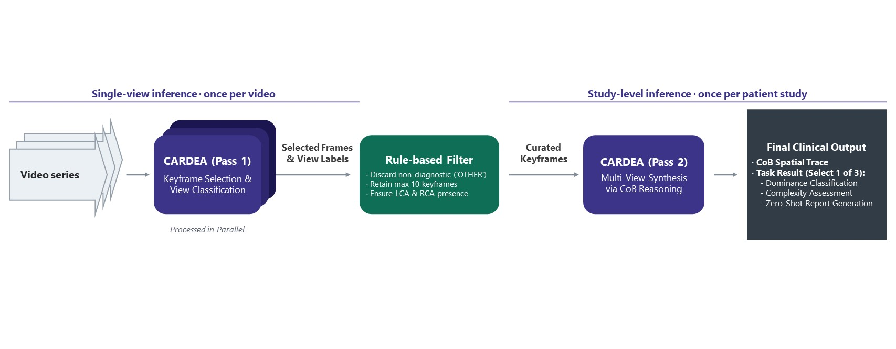

# CARDEA

CARDEA is a single vision-language model that interprets coronary angiography
end-to-end, from raw multi-view sequences through keyframe selection to study-level
diagnosis, grounding its conclusions in explicit spatial evidence so clinicians can
audit its reasoning.

This repo is the inference code and demo for the released model. Weights
are on [Hugging Face](https://huggingface.co/benbayibaurba/cardea-v0); method and
evaluation are in the [paper](https://arxiv.org/abs/2609.06931).

Non-commercial research use only. See License and disclaimer below.

## Pipeline



CARDEA runs a two-pass pipeline. A first pass filters non-diagnostic frames via
keyframe selection and view classification (LCA, RCA, or OTHER), keeping the coronary
(LCA / RCA) frames. A second pass applies **Chain-of-Box (CoB)** reasoning over the
curated multi-view keyframes to produce three study-level outputs:

- **Dominance Classification** — Left or Right, by the SYNTAX definition.
- **Complexity Assessment** — the SYNTAX score discretized into low-to-intermediate
  (≤ 32) vs. high (> 32) risk.
- **Report Generation** — a structured report covering findings in the four major branches
  (LM, LAD, LCX, RCA), never trained yet clearly improved after RLVR.

In CoB, the model embeds bounding boxes as spatial anchors within its reasoning trace,
so a reader can audit how a conclusion was reached.

**Caveat:** Although CARDEA performs CoB on nearly every in-distribution diagnosis, its
usage falls on out-of-distribution imaging or tasks. Repeated sampling narrows this gap
at essentially no change in accuracy, and the demo's Chain-of-Box resampling option does
exactly that. The paper reports the full coverage figures and analysis.

## Run

Needs a CUDA host with Docker and the NVIDIA Container Toolkit.

Settings live in `.env` (copy it from `.env.example`), or pass any of them inline:

- `TP_SIZE` — vLLM tensor-parallel size.
- `GPU_MEM_UTIL` — fraction of each GPU's memory allocated to vLLM (default: `0.9`).
- `HF_HOME` — host Hugging Face cache path mounted into the vLLM container.
- `VLLM_PORT` / `APP_PORT` — host ports for the vLLM API and demo.

```bash
docker compose up
# or, e.g.:  TP_SIZE=4 GPU_MEM_UTIL=0.8 docker compose up
```

This starts vLLM (official image) serving the model, with the demo app in front of
it. Open http://localhost:7860 (or your `APP_PORT`). The model downloads on first run
and is cached in a volume.

## Library

Install and point the client at a running endpoint:

```bash
pip install -e .
export CARDEA_BASE_URL=http://localhost:8000/v1
```

Run the whole thing in one call:

```python
import asyncio
from cardea.pipeline import run_pipeline

clip_paths = ["study/clip1.dcm", "study/clip2.dcm"]   # one patient study's clips
study_result = asyncio.run(run_pipeline(clip_paths))
if study_result.fail_reason:
    print(study_result.fail_reason)
else:
    print(study_result.dominance.answer)
    print(study_result.complexity.answer)
    print(study_result.report.answer.model_dump())
```

For the task-level implementation corresponding to the paper's two-pass
method, including streaming and Chain-of-Box outputs, see the
[pipeline walkthrough](docs/pipeline.md).

## Layout

```
docker-compose.yml      vLLM plus the demo
docker/Dockerfile       image for the demo app
src/cardea/
  client.py             OpenAI-compatible vLLM client
  task.py               shared run / stream contract and typed results
  outputs.py            public task output contracts
  streaming.py          live snapshots and Chain-of-Box rollout selection
  imaging.py            DICOM reading, frames, image parts
  thinking.py           Qwen reasoning / answer stream decoding
  boxes.py              Chain-of-Box parsing
  prompts.py            grounding text and output formatting
  pipeline.py           task orchestration
  tasks/
    keyframe.py         keyframe selection
    view.py             view classification
    dominance.py        dominance (Left / Right)
    report.py           structured report
    complexity.py       SYNTAX complexity
app/
  demo.py               Gradio demo
  chat_log.py           chat rendering and box overlays
docs/pipeline.md        annotated two-pass pipeline
```

## Reference

Jia-Jen Lee, Shih-Yen Hou, Kee Koon Ng, Wei-Chun Wang, and Shih-Sheng Chang.
CARDEA: Auditable Reasoning Grounded in Spatial Evidence for End-to-End Coronary
Angiography Interpretation. arXiv:2609.06931 [cs.CV], 2026.

```bibtex
@misc{lee2026cardea,
  title={CARDEA: Auditable Reasoning Grounded in Spatial Evidence for End-to-End Coronary Angiography Interpretation},
  author={Jia-Jen Lee and Shih-Yen Hou and Kee Koon Ng and Wei-Chun Wang and Shih-Sheng Chang},
  year={2026},
  eprint={2609.06931},
  archivePrefix={arXiv},
  primaryClass={cs.CV},
  url={https://arxiv.org/abs/2609.06931}
}
```

## License and disclaimer

Non-commercial research use only, under the PolyForm Noncommercial License 1.0.0
(see [LICENSE](LICENSE)). Copyright China Medical University Hospital and China
Medical University. For a commercial license, contact the authors.

CARDEA is a research model. It has not been reviewed or approved by any
medical regulatory authority (such as the U.S. FDA or Taiwan's TFDA), is not a
medical device, and has not been validated for clinical use. Do not use it, or any
output it produces, to diagnose, treat, or inform the care of any patient. Use it
only for lawful, non-commercial research on de-identified data. The software and
model are provided "as is", without warranty; the authors accept no liability for
any use.
